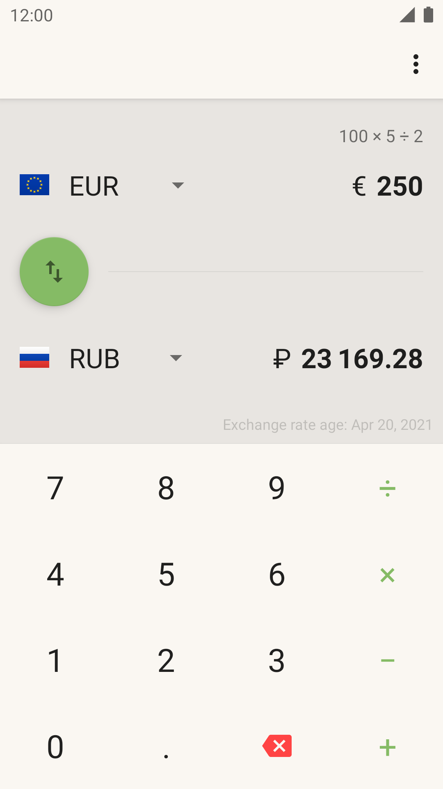
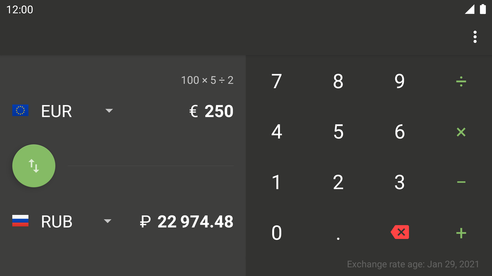

# Currencies

<!-- badges -->

   
   

<!-- logo -->

   

**Currencies** is a [simple](https://en.wikipedia.org/wiki/KISS_principle) and straightforward currency converter.
It is **not** intended to be used for realtime financial business, rather to be a handy companion e.g., on vacations.

<!-- buttons -->

   
   
   

## Features

* The app supports all relevant currencies. You can choose between several exchange rate providers:
   * [frankfurter.app](https://frankfurter.app/) with **over 30 currencies**, provided by the European Central Bank
   * [fer.ee](https://fer.ee/): an alternative service that behaves just like Frankfurter.app
   * [InforEuro](https://commission.europa.eu/funding-tenders/procedures-guidelines-tenders/information-contractors-and-beneficiaries/exchange-rate-inforeuro_en): provides the European Commission’s official monthly accounting rates for the euro and **over 150 corresponding conversion rates**
   * [Bank of Canada](https://www.bankofcanada.ca/rates/exchange/daily-exchange-rates/) provides about 23 currency rates of the Canadian Central Bank
   * The Norwegian Central Bank [Norges Bank](https://www.norges-bank.no/en/topics/Statistics/exchange_rates/) lists some 40 exchange rates
   * The Russian Central Bank [Bank Rossii](https://cbr.ru/eng/currency_base/daily/) gives probably the most reliable data of exchange rates to Russian Ruble. Some 44 exchange rates are listed
* The UI is simple and pure Material 3 Design.
* Exchange rate history: Check out the chart for the past year, to see how the currencies have developed.
* Historical rates: You can use rates from prior dates.
* A major feature is the included calculator. Useful e.g., if you want to split up a restaurant bill.
* Fee calculator: optionally add a customizable foreign exchange fee to all calculations.
* **Currencies** is written for Android in Kotlin, targeting Android 13 and supporting light and dark themes.
* The app is ad-free and doesn't spy on the user.

## Screenshots

   
   

## Development

Check out [CONTRIBUTING.md](CONTRIBUTING.md), if you are interested in participating.

## License

Copyright 2020 Maximilian Salomon

This program is free software: you can redistribute it and/or modify it under the terms of the GNU General Public License as published by the Free Software Foundation, either version 3 of the License, or (at your option) any later version.
This program is distributed in the hope that it will be useful, but WITHOUT ANY WARRANTY; without even the implied warranty of MERCHANTABILITY or FITNESS FOR A PARTICULAR PURPOSE. See the GNU General Public License for more details.
You should have received a copy of the GNU General Public License along with this program. If not, see [http://www.gnu.org/licenses](http://www.gnu.org/licenses/).
