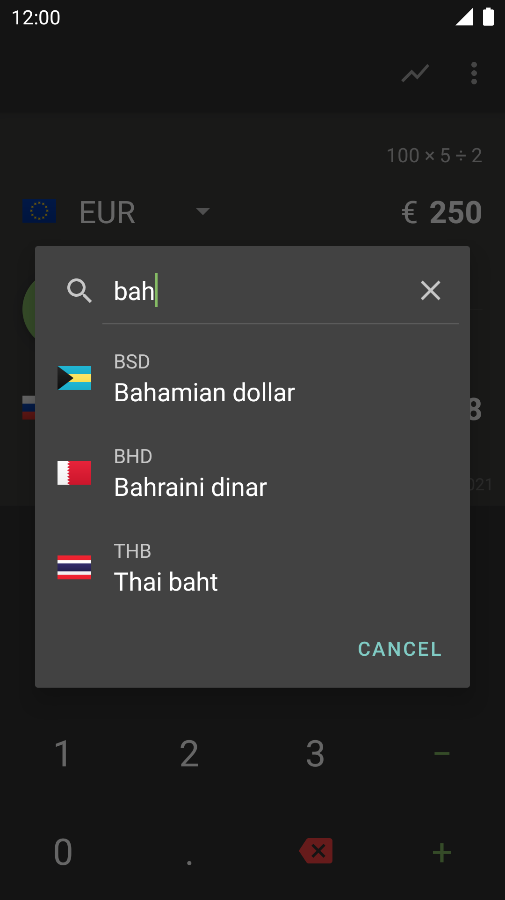

# Currencies

   

**Currencies** is a [simple](https://en.wikipedia.org/wiki/KISS_principle) and straightforward currency converter.
It is **not** intended to be used for realtime financial business, rather to be a handy companion e.g. on vacations.

   
   

## Features

* It supports the most relevant currencies. Currently counting over 160!
* Currency data is provided on a daily basis by [exchangerate.host](https://exchangerate.host/)
* The UI is simple and pure Material Design.
* A major feature is the included calculator. Useful e.g. if you want to split up a restaurant bill.
* Fee calculator: optionally add a customizable foreign exchange fee to all calculations.
* **Currencies** is written for Android in Kotlin, targeting Android 11 and supporting light and dark themes.
* The app is ad-free and doesn't spy on the user.

## Screenshots

   
   

## License
Copyright 2021 Maximilian Salomon

This program is free software: you can redistribute it and/or modify it under the terms of the GNU General Public License as published by the Free Software Foundation, either version 3 of the License, or (at your option) any later version.
This program is distributed in the hope that it will be useful, but WITHOUT ANY WARRANTY; without even the implied warranty of MERCHANTABILITY or FITNESS FOR A PARTICULAR PURPOSE. See the GNU General Public License for more details.
You should have received a copy of the GNU General Public License along with this program. If not, see http://www.gnu.org/licenses/.
